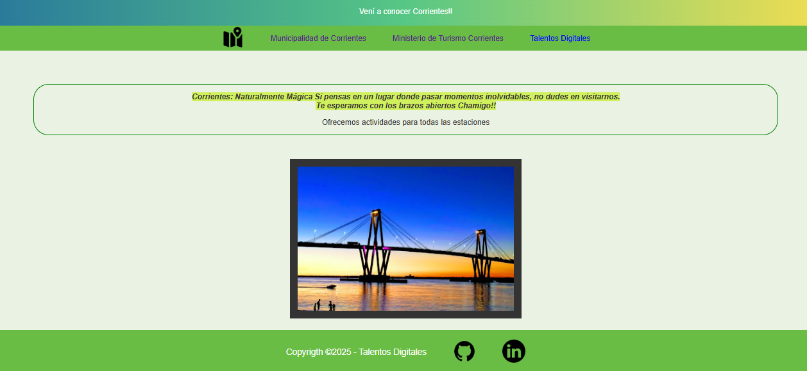

## Integrador

### El objetivo de esta actividad es familiarizarse con los conceptos CSS y etiquetas HTML.

La temática elegida es el turismo en Corrientes.

A continuación se comparte una captura de pantalla del resultado obtenido:

